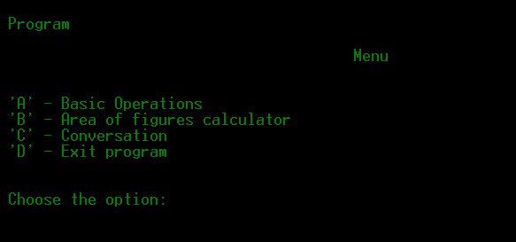
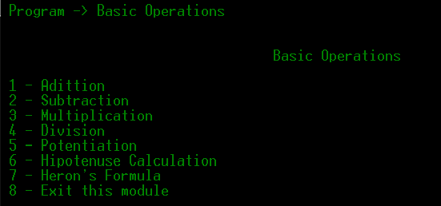
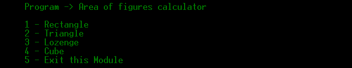
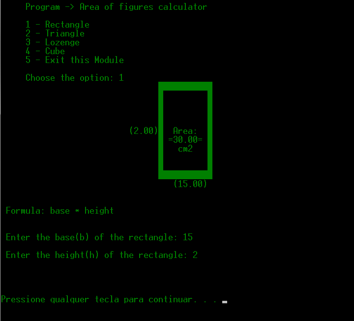
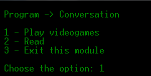
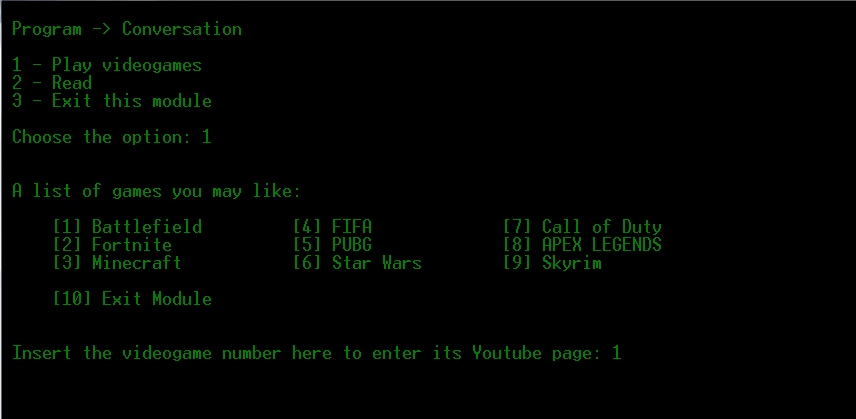
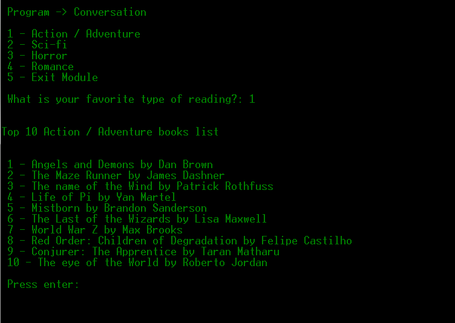

# Multirecursos-em-C  v1.0

# Projeto realizado sem fins-lucrativos, visando a aprendizagem própria da linguagem C.

Programa modular multi-recursos em C que realiza operações básicas, calcula a área de algumas figuras em 2D e te habilita ter uma dialogação simples, te levando ao canal oficial do YouTube de alguns jogos eletrônicos ou então te recomendando alguns livros.

# Menu principal

Digite alguma letra para entrar em algum módulo ou então para sair do programa.

# Esquema de menus

A - Operações básicas

Digite algum número para fazer a operação básica ou então volte ao menu principal.

Um exemplo de adição.

B - Calculadora de área de figuras em 2D básica

Digite o número representando a figura para calcular sua área.

Um exemplo do cálculo da área de um retângulo.

C - Conversação

Digite se prefere ir aos canais do YouTube de alguns jogos pré-definidos ou então ter a recomendação de alguns livros.

Digite algum jogo de videogame eletrônico e o programa te levará ao seu site oficial no YouTube.

Digite algum gênero literário e o programa te recomendará alguns livros.

# Observações: O código apresenta alguns bugs em sua lógica circular ao voltar alguns menus | É necessário baixar a ferramenta Dev-C++ para compilar o programa e torná-lo um arquivo executável.

Autoria própria.
